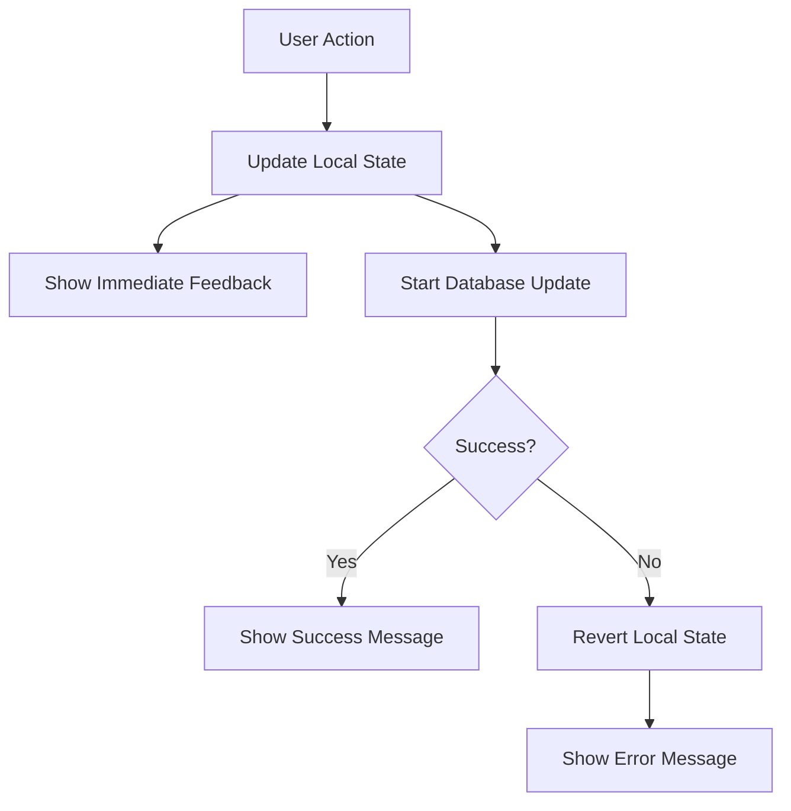

# 🚀 Optimistic Updates Implementation Guide

## Problem Solved

**Before:** Every time you updated any field in the CRM table (status, priority, comments, etc.), the entire table would refresh, causing:
- Loss of scroll position
- Flickering UI
- Poor user experience
- Slow interaction feedback

**After:** Updates now happen instantly in the UI while syncing with the database in the background.

## How It Works

### 1. **Optimistic Updates Pattern**

```javascript
// Old pattern (bad UX):
handleUpdate() {
  await updateDatabase()  // Wait for server
  refreshEntireTable()    // Reload everything
}

// New pattern (great UX):
handleUpdate() {
  updateUIImmediately()   // Instant feedback
  await updateDatabase()  // Background sync
  // Only revert UI if error occurs
}
```

### 2. **Implementation Details**

#### **SupabaseIntegration Component**
- **`handleOptimisticUpdate(recordId, updates)`** - Updates local state immediately
- **`handleFullRefresh()`** - Full table reload (only when needed)
- **`fetchData()`** - Loads data from database

#### **Updated Components**
All dropdown/input components now use optimistic updates:

1. **EditableTextField** (Comments)
2. **CompanyTypeDropdown** 
3. **PriorityDropdown**
4. **StatusDropdown**
5. **ConnectionStatusDropdown**
6. **LastChatDatePicker**

### 3. **Error Handling**

If a database update fails:
1. User sees error message
2. UI automatically reverts to previous value
3. No manual refresh needed

```javascript
try {
  await updateDatabase(newValue)
  // Success - UI already updated
} catch (error) {
  // Error - revert UI to original value
  onUpdate(recordId, { field: originalValue })
  showErrorMessage(error)
}
```

## Benefits

### ✅ **Immediate Feedback**
- Changes appear instantly when you click
- No waiting for server response
- Smooth, responsive interface

### ✅ **Preserved Context**
- Scroll position maintained
- Sorting/grouping preserved
- Filters remain active
- Column visibility unchanged

### ✅ **Better Error Handling**
- Clear error messages
- Automatic reversion on failure
- No lost work

### ✅ **Reduced Server Load**
- No unnecessary full table reloads
- Only changed data transmitted
- Better performance

## Usage Examples

### **Updating Company Status**
```javascript
// User clicks status dropdown
// ✅ Status changes immediately in UI
// 🔄 Database update happens in background
// ✅ Success message appears
// ❌ If error: status reverts + error message
```

### **Editing Comments**
```javascript
// User edits comment and saves
// ✅ Comment updates immediately
// 🔄 Database sync in background
// ✅ Table stays exactly where it was
```

### **Setting Last Chat Date**
```javascript
// User picks a date
// ✅ Date appears immediately
// 🔄 Database update in background
// ✅ Color coding updates instantly
```

## Technical Architecture

### **State Management Flow**



### **Component Communication**

```javascript
// Parent passes optimistic update function
<DataTable 
  onUpdate={handleOptimisticUpdate}      // For instant updates
  onFullRefresh={handleFullRefresh}      // For rare full reloads
/>

// Child components use optimistic updates
<StatusDropdown 
  onUpdate={(id, changes) => onUpdate(id, changes)}
/>
```

## When Full Refresh Still Happens

Optimistic updates are NOT used for:
- **AI Command execution** - May affect multiple records
- **Bulk operations** - LinkedIn search, cleanup suggestions
- **View switching** - Companies ↔ Contacts
- **Manual refresh button** - User explicitly requests it

## Best Practices

### **For Developers**

1. **Always provide error handling**
   ```javascript
   try {
     await updateDatabase()
   } catch (error) {
     revertOptimisticUpdate()
     showError(error)
   }
   ```

2. **Update UI first, then database**
   ```javascript
   onUpdate(id, newValue)  // Instant UI update
   await database.update() // Background sync
   ```

3. **Use meaningful loading states**
   ```javascript
   {isUpdating ? 'Saving...' : 'Save'}
   ```

### **For Users**

1. **Changes appear instantly** - No need to wait
2. **Errors are handled gracefully** - Values revert if something fails
3. **Context is preserved** - Your scroll position, filters, etc. stay intact
4. **Background sync is automatic** - No manual refresh needed

## Performance Impact

### **Before (Full Refresh)**
- **Time to feedback:** 500-2000ms
- **Network requests:** Full table reload (50+ records)
- **UI disruption:** Complete re-render
- **User experience:** Poor

### **After (Optimistic Updates)**
- **Time to feedback:** <50ms (instant)
- **Network requests:** Single field update
- **UI disruption:** None
- **User experience:** Excellent

## Monitoring & Debugging

### **Success Indicators**
- ✅ Green success messages in log
- ✅ Changes persist after page refresh
- ✅ No UI flickering

### **Error Indicators**
- ❌ Red error messages in log
- ❌ Values revert to original
- ❌ Network/database errors shown

### **Debug Tips**
1. Check browser network tab for API calls
2. Look for error messages in message log
3. Verify changes persist after refresh
4. Test with poor network conditions

---

**Result:** The CRM table now provides a modern, responsive user experience with instant feedback and reliable error handling! 🎉 